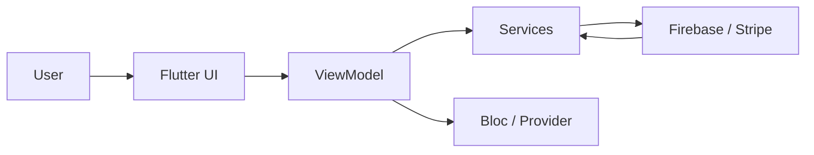
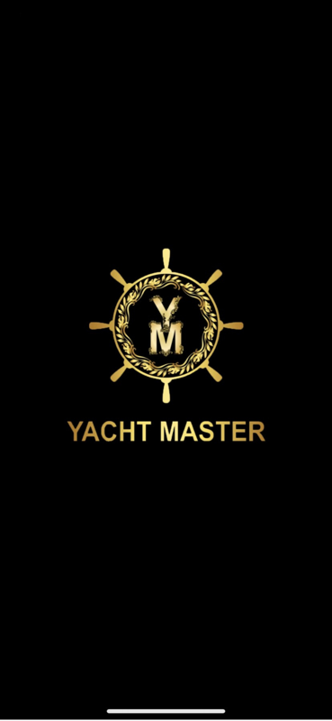
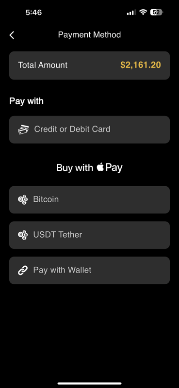
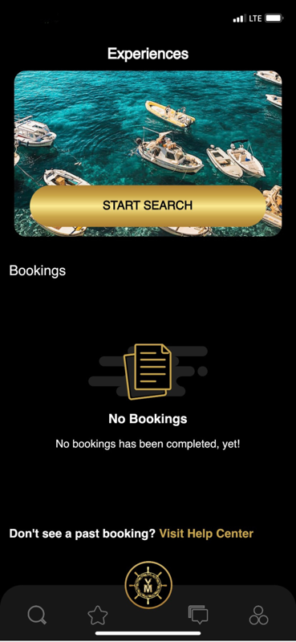
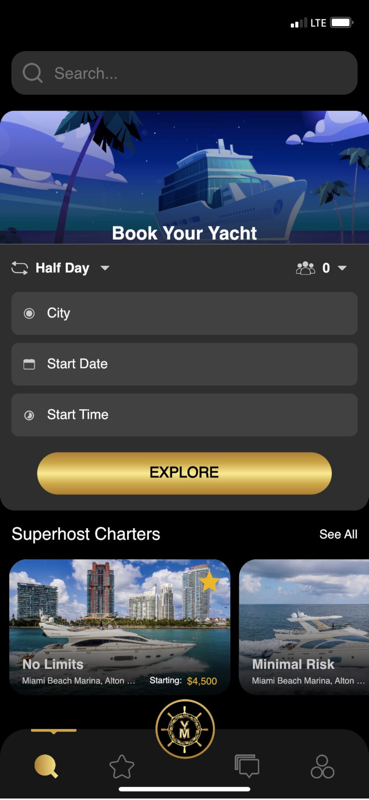
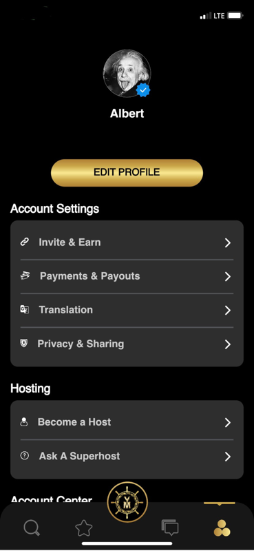
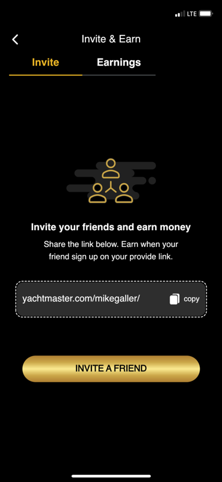

# YachtMaster-App

[](https://flutter.dev)
[](LICENSE)

## Table of Contents
- [YachtMaster-App](#yachtmaster-app)
  - [Table of Contents](#table-of-contents)
  - [Overview](#overview)
  - [Features](#features)
  - [Architecture](#architecture)
  - [Screenshots](#screenshots)
  - [Getting Started](#getting-started)
    - [Prerequisites](#prerequisites)
    - [Installation](#installation)
  - [Project Structure](#project-structure)
  - [Contributing](#contributing)
  - [License](#license)

## Overview
YachtMaster-App is a cross-platform Flutter application designed to connect yacht owners, guests, and service providers. It provides seamless booking, messaging, and payment experiences, leveraging Firebase services and Stripe for secure transactions.

## Features
- User authentication (email, social sign-in)
- Profile management and account settings
- Browse and search yacht listings
- Real-time chat and inbox functionality
- Booking workflow with split payments and crypto support
- Push notifications and in-app alerts
- Localization support (multiple languages)
- Admin dashboard for chat moderation and reporting

## Architecture
The application follows the MVVM (Model-View-ViewModel) pattern:
- **View**: Flutter widgets in `lib/src/.../view`
- **ViewModel**: Business logic in `lib/src/.../view_model`
- **Model**: Data structures in `lib/src/.../model`
- **Services**: External API interactions and utilities in `lib/services`



## Screenshots
Below are some screenshots showcasing the app (no specific labels):

<p align="center">
	
	
	
	
	
	
</p>

## Getting Started
### Prerequisites
- Flutter 3.7.0 or later
- Dart SDK 2.19.0 or later
- Firebase CLI
 
### Installation
```bash
git clone https://github.com/Powerclub-Global/YachtMaster-App.git
cd YachtMaster-App
flutter pub get
flutter run
```

## Project Structure
```
lib/
├── appwrite.dart
├── firebase_options.dart
├── main.dart
├── blocs/           # Bloc state management
├── constant/        # App constants and enums
├── localization/    # Localization and translation
├── resources/       # UI resources (colors, styles, images)
├── services/        # API and utility services
└── src/
		├── auth/        # Authentication modules
		├── base/        # Base views, VMs, and shared widgets
		├── landing_page/# Splash and landing screens
		└── utils/       # Helper utilities
```

## Contributing
Contributions are welcome! Please open an issue or submit a pull request for bug fixes and new features.

## License
This project is licensed under the MIT License. See the [LICENSE](LICENSE) file for details.
